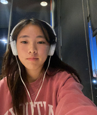
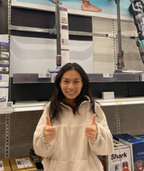

<!--Start of Website Content-->

    <h1>[EC]^2 GAL</h1>
    
Lesson on User Interface (UI) and Java

<!--About Our Team-->
<section class="team">
    <h1>MEET THE TEAM</h1>
    
description of the team

    

        

            <h1></h1>
            <h3>Luna Iwazaki</h3>
            
Product Owner

        

        

            <h1></h1>
            <h3>Grace Wang</h3>
            
Technical Lead

        

        

            <h1></h1>
            <h3>Emma Shen</h3>
            
SCRUM Master

        

    

</section>
<section class="team1">

    

        <h1></h1>
        <h3>Claire Chen</h3>
        
Developer

    

    

        <h1></h1>
        <h3>Claire Zhao</h3>
        
Developer

    

    

        <h1></h1>
        <h3>Annika Liao</h3>
        
Developer

    

    

        <h1></h1>
        <h3>Ellie Pang</h3>
        
Developer

    

</section>
<!-- 
<section class="about">
    <h3>OUR MISSION</h3>
    
Learning how to customize your website/game 
 -->

<!-- </section> -->