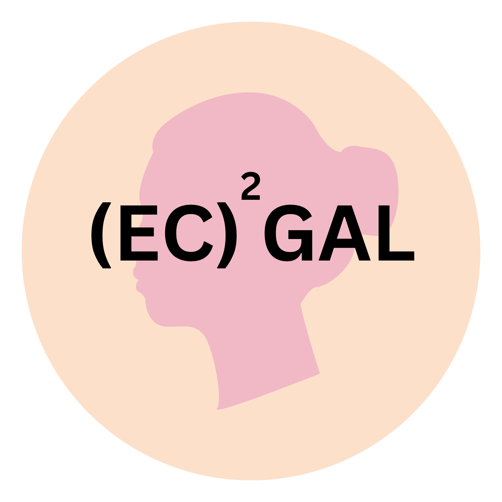
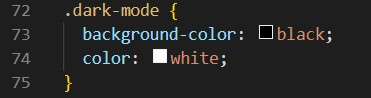
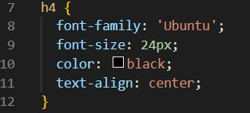
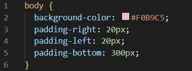
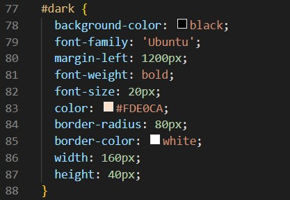
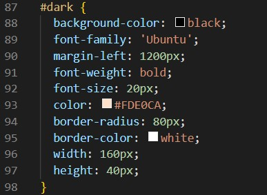
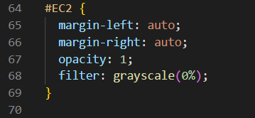
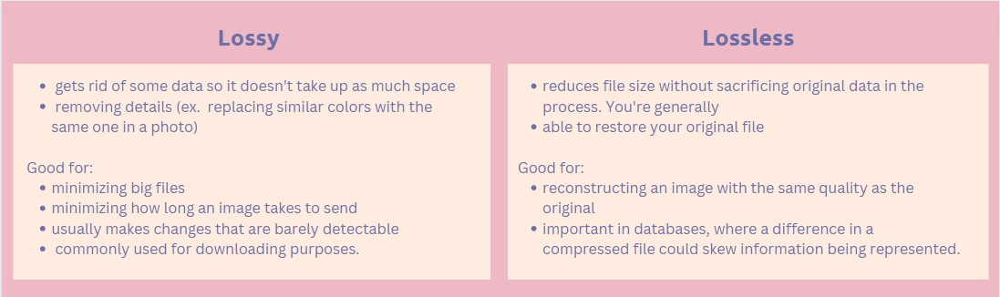
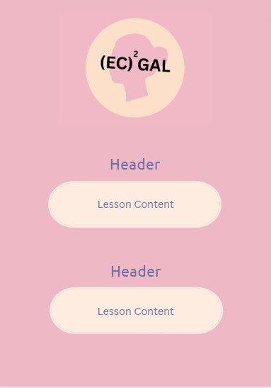

<html>
  <head>
    <link rel="stylesheet" href="page1.css">
    <link rel="stylesheet" href="https://fonts.googleapis.com/icon?family=Material+Icons">
  </head>
  <body>
    <button id="dark" onclick="darkMode()">Dark Mode</button>
    <h3></h3>
    <h4><i class="material-icons">favorite</i>click on each topic to learn more!<i class="material-icons">favorite</i></h4>
        

        <button onclick="visibility()">Basic User Interface (UI) Properties</button>
        

        

        <h2>Properties:</h2>
    

        <ul>
          <li>Color: This refers to the hue, saturation, and brightness of the UI elements such as background, text, buttons, etc.</li>
            <a href="https://htmlcolorcodes.com/">HTML Color Codes</a> 
            
              
          <li>Font: This refers to the typeface, size, weight, and style of the text displayed on the UI.</li>
            <a href="https://www.w3schools.com/css/css_font.asp">HTML Fonts</a> 
            
              
          <li>Layout: This refers to the arrangement and positioning of UI elements such as buttons, text boxes, images, etc</li>
            
Make wireframes to plan Layout!

            
Resources: canva

              
          <li>Icons: These are small graphical symbols used to represent actions or ideas in the UI.</li>
              
          <li>Interactivity: This refers to how the UI responds to user actions, such as clicking, tapping, dragging, and scrolling.</li>
              
          <li>Accessibility: This refers to the ability of the UI to be used by people with disabilities, such as support for screen readers, keyboard navigation, and color contrast.</li>
        </ul>
       
      
Identify all these properties on this page

    

        

        

        <button onclick="visibility2()">Adding/Changing Colors</button>
        

    

        <h2>Changing Text and Background Color:</h2>
        

    - The color property defines the foreground color of an HTML element's content and the background-color property defines the element's background color. 
      
    - Text: color property is used when drawing the text and any text decorations. 
      
    - backround-color is the text's backround color.
      
    - text-shadow: configues a shadow effect to apply to text
      
    - text-decoration-color: By default, text decorations use the color property as their colors. You can override that behavior and use a different color for them with the text-decoration-color property.
      
    Hex Color Codes: composed of a hashtag and three pairs of characters hat represent the intensity of the three primary colors. 
      
    - Value Range: 00 (the lowest intensity of a primary color) to FF (the highest intensity of a primary color)
      
    - Every hex code consists of six characters in total. These six characters can be any combination of ten numerals (0-9) and six letters (a-f) <a href="https://github.com/1908901/elliepang/issues/30">(more combinations)</a> 
     
    

    
    
    <h2>Themes</h2>
    

    Theming: gives the users the ability to make customizations to websites and applications.
      
     - Clicking a button to change the background of a website to red or black
      
     - Increasing or decreasing the font size of a site website/application
      
    - Clicking a button to remove content not relevant to the user.
      
    - fonts, font size, color schemes, layouts, asthetics, ect.
      
    Theme Properties: a set of CSS custom properties that make up a theme. <a href="https://github.com/1908901/elliepang/issues/30">example</a> 
     
    

    

      

    <button onclick="visibility3()">Images</button>
    

    

    

      <h2>Styling Images (No Animation)</h2>
      <ul>
        <li>rounded corners on images and buttons</li>
        <li>center</li>
        <li>opacity</li>
        <li>grayscale</li>
      </ul>
      
      
      <h2>Other Things You Need to Know for the AP Exam</h2>
      <h5>Data Compression</h5>
      
 click on image to see full screen
          
      <h5>base 64</h5>
        Binary data: Base64 is used to encode binary data, such as images, audio, and video files. You will need to understand how binary data is represented and stored in computing systems.
          
        ASCII encoding: Base64 converts binary data into ASCII text format, which can be transmitted and stored more easily than binary data. You will need to understand ASCII encoding and how it works.
          
        Encoding process: Base64 encodes binary data by splitting it into 6-bit chunks and encoding each chunk as a single character in the Base64 character set. You will need to understand how this encoding process works.
          
        Decoding process: Base64 also includes a decoding process that converts Base64-encoded text back into binary data. You will need to understand how this decoding process works.
    

    

        

        <button onclick="visibility4()">Importance of Wireframes</button>
        

  

        <h2>Properties:</h2>
    
    

    - allows designers to plan the layout and interaction of an interface without being distracted by colors or other factors of their website. 
      
    - Wireframes are also useful in determining how the user interacts with the interface (ex: buttons or menu behaviors)
      
    - keep the concept user-focused, they clarify and define website features, and they are quick to create
    

    

    